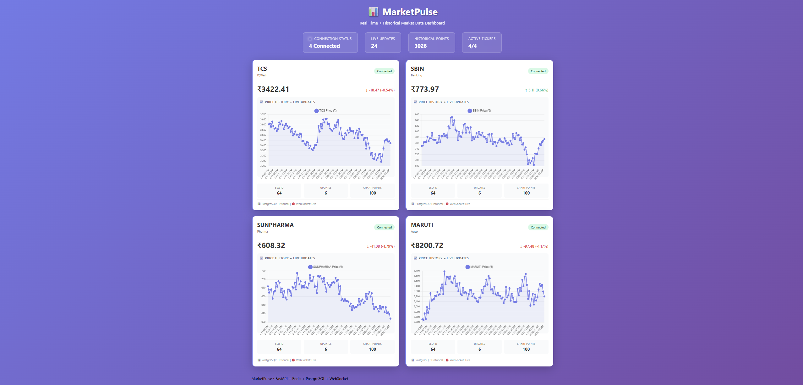
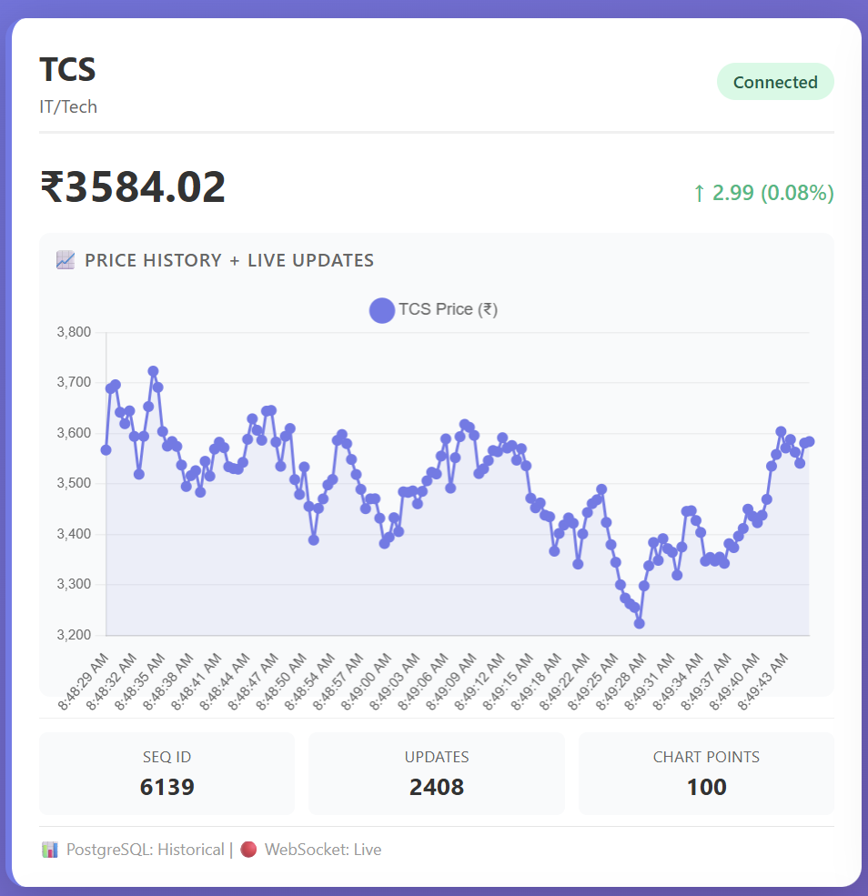

# MarketPulse

Real-time market analytics dashboard built using FastAPI, Redis, PostgreSQL and WebSockets.

The project combines historical market storage with live streaming updates and visualizes both through an interactive browser dashboard.

---

## Features

- Real-time stock updates using WebSockets
- Redis Pub/Sub event streaming
- PostgreSQL historical persistence
- Historical + live chart visualization
- Chart.js dashboard interface
- Docker-based setup support
- Automatic historical data loading
- Continuous log import pipeline

---

## Architecture

```text
                    +-------------------+
                    |   Market Maker    |
                    |  (Tick Generator) |
                    +---------+---------+
                              |
          +-------------------+-------------------+
          |                                       |
          v                                       v

+------------------+                +----------------------+
| Redis Pub/Sub    |                | PostgreSQL           |
| Real-time Stream |                | Historical Storage   |
+--------+---------+                +----------+-----------+
         |                                       |
         v                                       v

+----------------------------------------------------------+
|                     FastAPI Layer                         |
|----------------------------------------------------------|
| REST API (/history) | WebSocket (/ws/{ticker})           |
+----------------------+-----------------------------------+
                       |
                       v

              +----------------------+
              | Dashboard (Chart.js) |
              +----------------------+
```

---

## Tech Stack

### Backend

- FastAPI
- PostgreSQL
- Redis
- SQLAlchemy
- WebSockets

### Frontend

- HTML
- JavaScript
- Chart.js

### Infrastructure

- Docker
- Docker Compose

---

## Project Structure

```text
MarketPulse/
│
├── api/
│   ├── main.py
│   ├── manager.py
│   └── __init__.py
│
├── ingestion/
│   ├── market_maker.py
│   ├── consumer_examples.py
│   └── __init__.py
│
├── tests/
│
├── dashboard.html
├── db_init.py
├── continuous_importer.py
├── docker-compose.yml
├── requirements.txt
├── README.md
└── SETUP.md
```

---

## Dashboard

### Main Dashboard



### Live Charts and Historical Visualization


---

## System Workflow

1. Market Maker generates stock ticks every 500 ms

2. Generated ticks are:

- Published to Redis Pub/Sub for real-time delivery
- Stored in PostgreSQL for historical access

3. FastAPI exposes:

```text
/history/{ticker}
```

for historical retrieval

and

```text
/ws/{ticker}
```

for live updates

4. Dashboard:

- Loads historical records
- Opens WebSocket streams
- Updates charts in real time

---

## Performance Notes

- Tick generation interval: **500 ms**
- Historical records stored in PostgreSQL
- Dashboard loads latest historical points automatically
- WebSocket streaming through Redis Pub/Sub
- Continuous log-to-database import pipeline
- Supports multiple simultaneous ticker streams

---

## Tested Configuration

- 4 ticker streams

```text
TCS
SBIN
SUNPHARMA
MARUTI
```

- Historical dataset: **26k+ records**
- Multiple WebSocket clients tested
- Live dashboard rendering enabled

---

## Running Project

See:

```text
SETUP.md
```

Quick run:

```bash
python db_init.py

python continuous_importer.py

python ingestion/market_maker.py

uvicorn api.main:app --reload
```

Open:

```text
http://localhost:8000
```

---

## Resume Description

Built a real-time market analytics platform using FastAPI, Redis Pub/Sub, PostgreSQL and WebSockets to stream live stock updates while maintaining historical market records and interactive visualizations.

---

## Concepts Demonstrated

- Producer – Consumer Pattern
- Redis Pub/Sub
- WebSocket Streaming
- Historical + Real-time Architecture
- REST + WebSocket Hybrid Design
- Event-driven systems
- Data persistence pipeline

---

## Future Improvements

- Authentication layer
- More ticker streams
- Alert system
- Export historical data
- Deployment support
